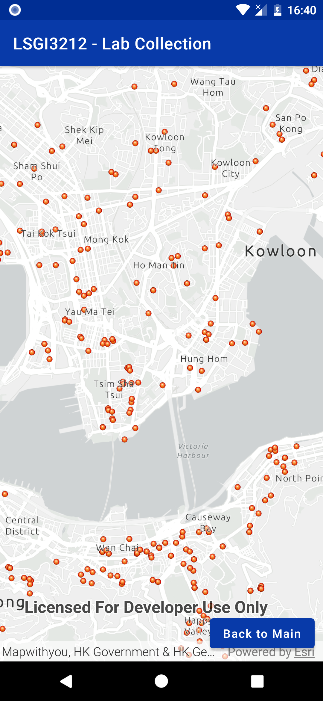
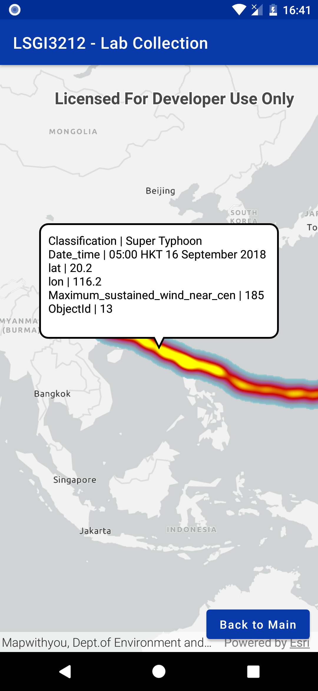
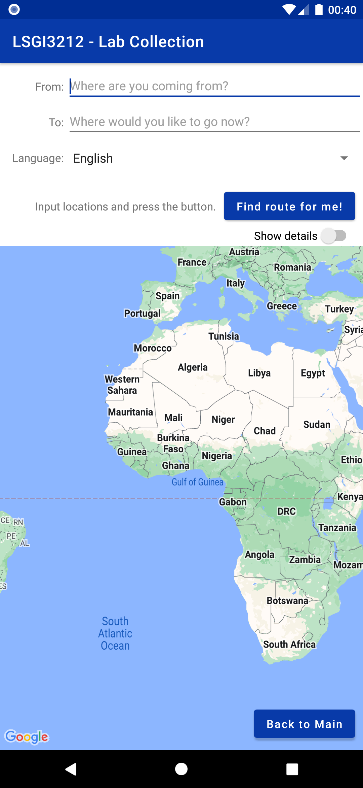

# LSGI541-2023
This repository contains an Android Studio project as an all-in-one example of lab assignments for LSGI541.

This project will be updated gradually as the course progresses.

For the tutorial notes, see [here](https://xiaoshengzhu.notion.site/Lab-Tutorials-for-LSGI541-Mobile-GIS-and-LBS-e8f3c248bb16492dafe06ee2165c83c4).

## Key files
- [Java codes](https://github.com/Gypsop/LSGI541-2023/tree/main/app/src/main/java/com/lsgi541/lab/collection)
- [XML layouts](https://github.com/Gypsop/LSGI541-2023/tree/main/app/src/main/res/layout)
- [Value definitions](https://github.com/Gypsop/LSGI541-2023/tree/main/app/src/main/res/values)

## Screenshots

      

